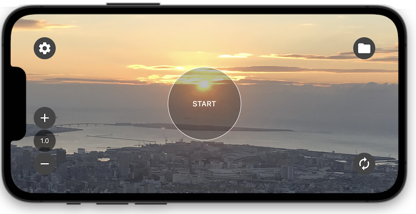

# Imasugu Keep Me

 

## :notebook: Features
- Interval photos and videos can be taken.
- Photos are taken every 5 minutes (can be changed)
- Videos are split every 10 minutes.
- Oldest files are automatically deleted when in-app data exceeds the set capacity.
- Data can be copied from in-app data to the Photos app.
- Has an automatic stop function.
- During recording, the screen saver will function to reduce battery consumption.
- The app will stop when it is in the background.

japanese
- インターバル写真・ビデオ撮影ができます。
- 写真は5分毎に撮影します（変更可）
- ビデオは10分毎に分割されます。
- アプリ内データは設定した容量を超えると古いファイルから自動的に削除します。
- アプリ内データから写真アプリにコピーができます。
- 自動的に停止する機能があります。
- 撮影中はスクリーンセーバーになりバッテリー消費を抑えます。
- アプリがバックグラウンド状態になると停止します。

